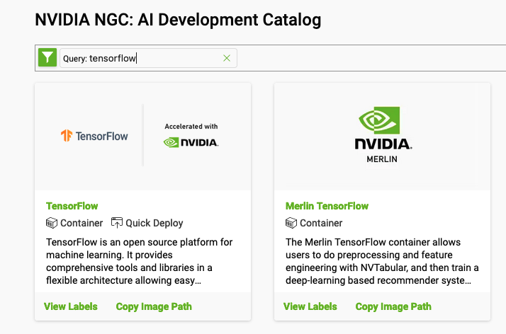
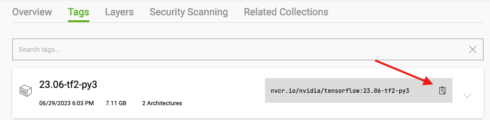

# Nvidia NGC Tensorflow Build

See our online documentation for more information on Nvidia NGC images: [Apptainer, Nvidia, and GPUs](https://public.confluence.arizona.edu/display/UAHPC/Containers#Containers-Apptainer,Nvidia,andGPUs)

## Overview
The NVIDIA GPU Cloud (NGC) provides GPU-accelerated HPC and deep learning containers for scientific computing.  NVIDIA tests HPC container compatibility with the Singularity runtime through a rigorous QA process. Application-specific information may vary so it is recommended that you follow the container-specific documentation before running with Singularity. If the container documentation does not include Singularity information, then the container has not yet been tested under Singularity. Apptainer can be used to pull, execute, and bootstrap off of Singularity images. 

In this example, we'll create an Apptainer recipe that boostraps off of an Nvidia NGC Tensorflow image and pip-installs custom Python packages. 

To start, you'll need to [register with Nvidia](https://ngc.nvidia.com/signin). Once you have an account, you can [view their images from their catalogue](https://catalog.ngc.nvidia.com/). Click on the name of the software you're interested in to view available versions.

## Build the Container

### Find Your Base Image

Start by navigating to the [Nvidia Registry](https://catalog.ngc.nvidia.com/). Then, under the search bar, enter the name of the image you're looking for. For example, Tensorflow and Pytorch are common options. 

 

Once you find and click the image repository you're looking for, go to the Tags tab. In this example, we'll use the latest (as of this writing) image that uses Python 3. The information needed to bootstrap off this image is the image path. Click the clipboard in the top right of the relevant tag to copy the path:

 

This should give you something like ```nvcr.io/nvidia/tensorflow:23.06-tf2-py3```. We'll use this to create our recipe.

### Recipe

Now, take the image path you got from the NGC site and add it to the image's header under ```FROM```. Under ```%post```

```
Bootstrap: docker
FROM: nvcr.io/nvidia/tensorflow:23.06-tf2-py3

%post
  pip install astropy
```


### Build

```
[netid@cpu6 ~]$ singularity build nvidia-tf23.06.astro.sif nvidia-tf23.06.astro.recipe 
INFO:    User not listed in /etc/subuid, trying root-mapped namespace
INFO:    The %post section will be run under fakeroot
INFO:    Starting build...
. . .
INFO:    Creating SIF file...
INFO:    Build complete: nvidia-tf23.06.astro.sif
```

## Job Example

### Python Script

```python
#!/usr/bin/env python3 

import tensorflow as tf
import astropy

print("Num GPUs Available: ", len(tf.config.list_physical_devices('GPU')))
```

### Batch Script

```bash
#!/bin/bash

#SBATCH --account=YOUR_GROUP_HERE
#SBATCH --partition=standard
#SBATCH --nodes=1
#SBATCH --ntasks=1
#SBATCH --gres=gpu:1
#SBATCH --time=00:05:00

singularity exec --nv nvidia-tf23.06.astro.sif python3 nvidia-test.py
```

### Submission
```terminal
[netid@wentletrap ~]$ sbatch nvidia-test.slurm 
Submitted batch job 2067225
```

### Output
```terminal
[netid@wentletrap ~]$ cat slurm-2067225.out 
INFO:    underlay of /etc/localtime required more than 50 (91) bind mounts
INFO:    underlay of /usr/bin/nvidia-smi required more than 50 (523) bind mounts
13:4: not a valid test operator: (
13:4: not a valid test operator: 530.30.02
2023-07-18 14:38:09.613020: I tensorflow/core/platform/cpu_feature_guard.cc:183] This TensorFlow binary is optimized to use available CPU instructions in performance-critical operations.
To enable the following instructions: SSE3 SSE4.1 SSE4.2 AVX, in other operations, rebuild TensorFlow with the appropriate compiler flags.
Num GPUs Available:  1
```

-----
[](https://ua-researchcomputing-hpc.github.io/) 
[](../)
