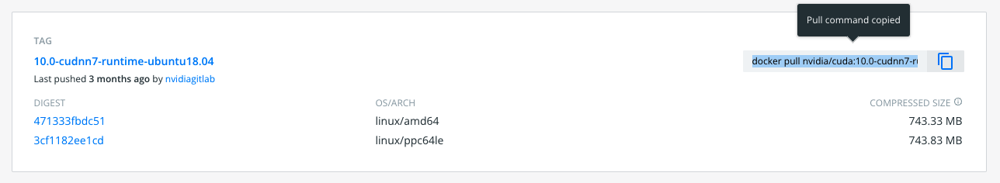

# Build Custom Tensorflow from a Cuda Image

[](tensorflow-from-cuda.tar.gz)

One option for running Tensorflow on HPC is to pull pre-built images from [Nvidia's NGC repository](https://public.confluence.arizona.edu/display/UAHPC/Containers#Containers-PullingNvidiaImages). Another option is building your own container. This example shows how to build a Tensorflow image bootstrapping off a Cuda Docker image.

The general steps to doing this are:

1. Identify which version of Tensorflow you need.
2. Identify a compatible version of Cuda.
3. Find a Cuda container on Docker Hub to bootstrap from.
4. Design your recipe.
5. Build!

In this example, we will build an image using Tensorflow 2.0.0, Cuda 10.0, and Python 3.6.

# Tensorflow and Cuda

One of the difficulties with installing Tensorflow natively on HPC is library versioning. To successfully use a GPU requires that the proper version of Cuda be installed and this is not always possible. For example, older versions of Tensorflow require Cuda 10 and earlier which our drivers do not support.

To find the Cuda you need for your image, see [Tensorflow's documentation on version compatabilities](https://www.tensorflow.org/install/source#tested_build_configurations). In this case, because we want to install Tensorflow 2.0.0, we will need to use Cuda 10.0.

To build an image using Cuda 10.0, we will go to [Nvidia's Docker Hub repository](https://hub.docker.com/r/nvidia/cuda), go to the Tags tab, and search 10.0:


Tensorflow requires cuDNN libraries so we'll need to find a tag that includes these. We'll also look for an Ubuntu OS (multiple versions are typically available). In this case, we'll choose Ubuntu 18.04. Once you find the tag you want, click the blue rectagles on the right to copy the ```docker pull``` command to your clipboard:



The specific command for this tag is ```docker pull nvidia/cuda:10.0-cudnn7-runtime-ubuntu18.04```

# Creating Your Recipe

> For more detailed information on writing your own Apptainer recipes, see [Singularity's definition files](https://sylabs.io/guides/3.0/user-guide/definition_files.html) documentation. 

To create your definition file, navigate to your preferred directory on HPC and open a plain text document. Name it something descriptive, e.g. ```tensorflow-2.0.0-py36.recipe```. This is where we'll write out the blueprints that will be used to create our image.

## Header
First, we'll enter a header that will be used to pull Docker layers from Dockerhub. This is where you will paste in the command you copied to your clipboard. You will need to remove the ```docker pull``` at the start of the command. The header should look like:

```singularity
Bootstrap: docker
FROM:  nvidia/cuda:10.0-cudnn7-devel-ubuntu18.04 
```

## Post
The ```%post``` section contains all the commands that will be executed during the build once the base OS has been installed. This will include installing system software and libraries, downloading files, setting environment variables, pip-installing your python packages, etc. We'll start by sourcing ```/environment``` (this sets relevant default environment variables) and set any necessary paths to point the system to our Cuda libraries:

```singularity
  %post
  . /environment
  SHELL=/bin/bash
  CPATH="/usr/local/cuda/include:$CPATH"
  PATH="/usr/local/cuda/bin:$PATH"
  LD_LIBRARY_PATH="/usr/local/cuda/lib64:$LD_LIBRARY_PATH"
  CUDA_HOME="/usr/local/cuda"
```

Next, we'll need to install system libraries and software using [```apt-get```](https://en.wikipedia.org/wiki/APT_(software)). This will give us access to things like ```wget``` and Python 3.6:
```singularity
  apt-get update
  apt-get install -y wget git vim build-essential cmake libgtk2.0-0 python3.6 python3.6-dev python3.6-venv python3-distutils python3-apt libgtk-3-dev xauth curl
```
To install packages like Tensorflow, we'll need to install ```pip```:
```singularity
  wget https://bootstrap.pypa.io/pip/3.6/get-pip.py
  python3.6 get-pip.py
```
Additionally, we'll make our lives a little easier by creating a command ```python3``` so we don't have to use ```python3.6``` whenever we want to use Python:
```singularity
ln -s /usr/bin/python3.6 /usr/local/bin/python3
```
Now come the pip installs. This is where you would add any Python packages you need. You can use pypi to find the install commands for [previous releases of tensorflow-gpu](https://pypi.org/project/tensorflow-gpu/#history) (as well as other packages). In this case, we'll install tensorflow-gpu 2.0.0 and an additional non-standard package:
```singularity
  pip install tensorflow-gpu==2.0.0
  pip install astropy 
```

## Environment
The last section we'll create is called ```%environment``` and contains all the environment variables that will be set at the containers runtime. There will be some overlap/redundancy with the ```%post``` section. This is because the variables set during the build stage do not carry over to runtime and the variables set in ```%environment``` will not be invoked during the build.
```singularity
  %environment
  # use bash as default shell
  SHELL=/bin/bash
  # add CUDA paths
  CPATH="/usr/local/cuda/include:$CPATH"
  PATH="/usr/local/cuda/bin:$PATH"
  LD_LIBRARY_PATH="/usr/local/cuda/lib64:$LD_LIBRARY_PATH"
  CUDA_HOME="/usr/local/cuda"
  export PATH LD_LIBRARY_PATH CPATH CUDA_HOME
```

# Full Recipe
```singularity
Bootstrap: docker
FROM:  nvidia/cuda:10.0-cudnn7-devel-ubuntu18.04 


%post
  . /environment
  SHELL=/bin/bash
  CPATH="/usr/local/cuda/include:$CPATH"
  PATH="/usr/local/cuda/bin:$PATH"
  LD_LIBRARY_PATH="/usr/local/cuda/lib64:$LD_LIBRARY_PATH"
  CUDA_HOME="/usr/local/cuda"
  apt-get update
  apt-get install -y wget git vim build-essential cmake libgtk2.0-0 python3.6 python3.6-dev python3.6-venv python3-distutils python3-apt libgtk-3-dev xauth curl
  wget https://bootstrap.pypa.io/pip/3.6/get-pip.py
  python3.6 get-pip.py
  ln -s /usr/bin/python3.6 /usr/local/bin/python3
  pip install tensorflow-gpu==2.0.0
  pip install astropy 

%environment
  # use bash as default shell
  SHELL=/bin/bash
  # add CUDA paths
  CPATH="/usr/local/cuda/include:$CPATH"
  PATH="/usr/local/cuda/bin:$PATH"
  LD_LIBRARY_PATH="/usr/local/cuda/lib64:$LD_LIBRARY_PATH"
  CUDA_HOME="/usr/local/cuda"
  export PATH LD_LIBRARY_PATH CPATH CUDA_HOME
```

# Building the Image

Save your file and exit your text editor. Then, in an [interactive session](https://public.confluence.arizona.edu/display/UAHPC/Running+Jobs+with+SLURM#RunningJobswithSLURM-interactive-jobsInteractiveJobs), build your image using ```apptainer build```. 

```console
[netid@i16n0 ~]$ apptainer build tensorflow-2.0.0-py36.sif tensorflow-2.0.0-py36.recipe 
INFO:    User not listed in /etc/subuid, trying root-mapped namespace
INFO:    The %post section will be run under fakeroot
INFO:    Starting build...
. . .
INFO:    Adding environment to container
INFO:    Creating SIF file...
INFO:    Build complete: tensorflow-2.0.0-py36.sif
```

Once your container has been created, it's ready to use. 

# Job Example
To verify that our container is working, we'll submit a sample job to a GPU node. The flag ```--nv``` statement is required following ```apptainer exec``` for any job that needs to make use of a GPU.

We'll create and open a script called tensorflow-job.slurm and add the following contents:

```bash
#!/bin/bash
#SBATCH --job-name=tensorflow-test
#SBATCH --account=YOUR_GROUP
#SBATCH --partition=standard
#SBATCH --ntasks=1
#SBATCH --nodes=1
#SBATCH --gres=gpu:1
#SBATCH --time=0:1:0

apptainer exec --nv tensorflow-2.0.0-py36.sif python3 tensorflow-test.py
```

## Python Script

We'll also create a small python script called tensorflow-test.py that imports the relevant modules and tests whether tensorflow can find the GPU. 

```python
import astropy
import tensorflow as tf
print("Tensorflow version: %s\n"%tf.__version__,flush=True)
tf.test.is_gpu_available()
```


## Submitting the Job
We'll submit the job on Ocelote since this is the cluster with the most GPU nodes and typically the shortest wait time:
```console
[netid@i16n0 ~]$ sbatch tensorflow-job.slurm 
Submitted batch job 1471232
```

## Job Output
```console
[netid@i16n0 ~]$ cat slurm-1471232.out 
INFO:    underlay of /etc/localtime required more than 50 (104) bind mounts
INFO:    underlay of /usr/bin/nvidia-smi required more than 50 (540) bind mounts
Tensorflow version: 2.0.0

2022-12-05 13:40:14.136611: I tensorflow/core/platform/cpu_feature_guard.cc:142] Your CPU supports instructions that this TensorFlow binary was not compiled to use: AVX2 FMA
2022-12-05 13:40:14.193284: I tensorflow/core/platform/profile_utils/cpu_utils.cc:94] CPU Frequency: 2399970000 Hz
2022-12-05 13:40:14.196449: I tensorflow/compiler/xla/service/service.cc:168] XLA service 0x4a21540 executing computations on platform Host. Devices:
2022-12-05 13:40:14.196468: I tensorflow/compiler/xla/service/service.cc:175]   StreamExecutor device (0): Host, Default Version
2022-12-05 13:40:14.319624: I tensorflow/stream_executor/platform/default/dso_loader.cc:44] Successfully opened dynamic library libcuda.so.1
2022-12-05 13:40:14.594376: I tensorflow/compiler/xla/service/service.cc:168] XLA service 0x382e070 executing computations on platform CUDA. Devices:
2022-12-05 13:40:14.594406: I tensorflow/compiler/xla/service/service.cc:175]   StreamExecutor device (0): Tesla P100-PCIE-16GB, Compute Capability 6.0
2022-12-05 13:40:14.595585: I tensorflow/core/common_runtime/gpu/gpu_device.cc:1618] Found device 0 with properties: 
name: Tesla P100-PCIE-16GB major: 6 minor: 0 memoryClockRate(GHz): 1.3285
pciBusID: 0000:0b:00.0
2022-12-05 13:40:14.603428: I tensorflow/stream_executor/platform/default/dso_loader.cc:44] Successfully opened dynamic library libcudart.so.10.0
2022-12-05 13:40:14.668479: I tensorflow/stream_executor/platform/default/dso_loader.cc:44] Successfully opened dynamic library libcublas.so.10.0
2022-12-05 13:40:14.689120: I tensorflow/stream_executor/platform/default/dso_loader.cc:44] Successfully opened dynamic library libcufft.so.10.0
2022-12-05 13:40:14.711343: I tensorflow/stream_executor/platform/default/dso_loader.cc:44] Successfully opened dynamic library libcurand.so.10.0
2022-12-05 13:40:14.788839: I tensorflow/stream_executor/platform/default/dso_loader.cc:44] Successfully opened dynamic library libcusolver.so.10.0
2022-12-05 13:40:14.819715: I tensorflow/stream_executor/platform/default/dso_loader.cc:44] Successfully opened dynamic library libcusparse.so.10.0
2022-12-05 13:40:14.898448: I tensorflow/stream_executor/platform/default/dso_loader.cc:44] Successfully opened dynamic library libcudnn.so.7
2022-12-05 13:40:14.901426: I tensorflow/core/common_runtime/gpu/gpu_device.cc:1746] Adding visible gpu devices: 0
2022-12-05 13:40:14.902814: I tensorflow/stream_executor/platform/default/dso_loader.cc:44] Successfully opened dynamic library libcudart.so.10.0
2022-12-05 13:40:14.909680: I tensorflow/core/common_runtime/gpu/gpu_device.cc:1159] Device interconnect StreamExecutor with strength 1 edge matrix:
2022-12-05 13:40:14.909698: I tensorflow/core/common_runtime/gpu/gpu_device.cc:1165]      0 
2022-12-05 13:40:14.909705: I tensorflow/core/common_runtime/gpu/gpu_device.cc:1178] 0:   N 
2022-12-05 13:40:14.913306: I tensorflow/core/common_runtime/gpu/gpu_device.cc:1304] Created TensorFlow device (/device:GPU:0 with 15223 MB memory) -> physical GPU (device: 0, name: Tesla P100-PCIE-16GB, pci bus id: 0000:0b:00.0, compute capability: 6.0)
Detailed performance metrics for this job will be available at https://metrics.hpc.arizona.edu/#job_viewer?action=show&realm=SUPREMM&resource_id=5&local_job_id=1471232 by 8am on 2022/12/06.
```


*****
[](https://ua-researchcomputing-hpc.github.io/) 
[](../)
