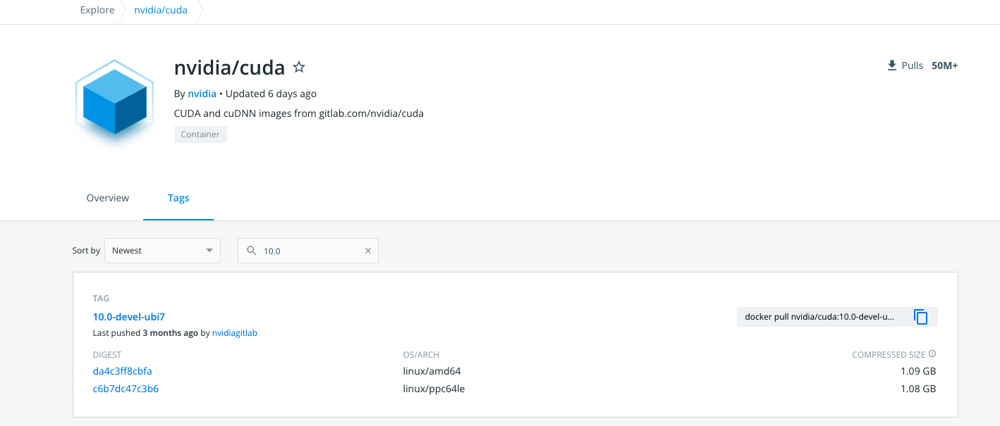

One option for running Tensorflow on HPC is to pull pre-built images from [Nvidia's NGC repository](https://public.confluence.arizona.edu/display/UAHPC/Containers#Containers-PullingNvidiaImages). Another option is building your own container. This example shows how to build a Tensorflow image bootstrapping off a Cuda Docker image.

The general steps to doing this are:

1. Identify which version of Tensorflow you need.
2. Identify a compatible version of Cuda.
3. Find a Cuda container on Docker Hub to bootstrap from.
4. Design your recipe.
5. Build!

In this example, we will build an image using Tensorflow 2.0.0, Cuda 10.0, and Python 3.6.

# Tensorflow and Cuda

One of the difficulties with installing Tensorflow natively on HPC is library versioning. To successfully use a GPU requires that the proper version of Cuda be installed and this is not always possible. For example, older versions of Tensorflow require Cuda 10 and earlier which our drivers do not support.

To find the Cuda you need for your image, see [Tensorflow's documentation on version compatabilities](https://www.tensorflow.org/install/source#tested_build_configurations). In this case, because we want to install Tensorflow 2.0.0, we will need to use Cuda 10.0.

To build an image using Cuda 10.0, we will go to [Nvidia's Docker Hub repository](https://hub.docker.com/r/nvidia/cuda), go to the Tags tab, and search 10.0:

