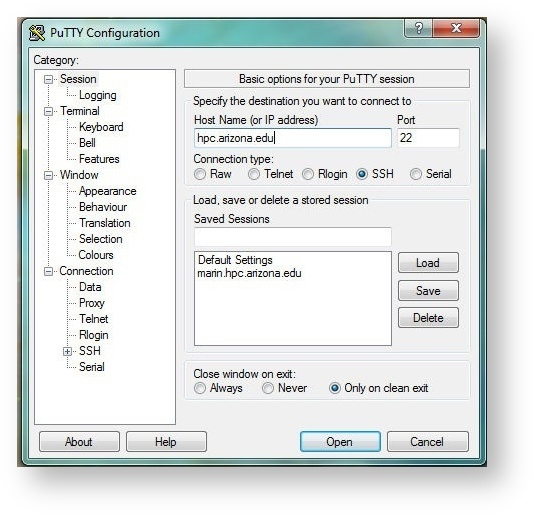

# Intro to HPC Workshop


## Contents
 

1. [Overview](#overview)
2. [System Basics](#system-basics)
     1. [Logging In](#logging-in)
     2. [Basic Commands](#basic-commands)
3. [Submitting a Sample Job](#submitting-a-sample-job)
     1. [Accessing Workshop Files](#accessing-workshop-files)
     2. [Submission Script Details](#submission-script-overview)
     3. [Submitting a Batch Job](#submitting-your-batch-job)
<br clear="right"/>


# Get the Files

[](intro-to-hpc.tar.gz)[](IntroToHPC.pdf)

# Overview

This short training class is available to users periodically throughout each academic year. Information on upcoming workshops can be found in our [training documentation](https://public.confluence.arizona.edu/display/UAHPC/Training). Before each workshop, an email will be sent to all HPC users through hpc-announce with information on dates, times, location, and how to register.

This training course will help you get started on using HPC resources.  If you have recently started, you might learn there is a better way, or there are capabilities you are not taking advantage of. You may also want to go through our [quick start](https://public.confluence.arizona.edu/display/UAHPC/Puma+Quick+Start) for additional information.

A PDF of the slides from past workshops can be found in our training documentation linked above and can be downloaded by clicking the Download PDF button at the top of this page. A summary of the training material for the interactive component of this workshop can be found below.


# System Basics

## Logging In
 

To begin, open a terminal session and connect to HPC. This can be done two ways, either using your own terminal/SSH client, or through our Open OnDemand web interface. You will use your university credentials (NetID and password) to access the system and will also be prompted for a method to duo authenticate after.

Detailed information can be found in our [online documentation](https://public.confluence.arizona.edu/display/UAHPC/System+Access#SystemAccess-CommandLine/TerminalAccess).

<br clear="left"/>

### Local terminal
#### Mac/Linux
On a Mac or Linux, open a Terminal (on Mac, this can be found under Applications -> Utilities), and enter 
```
$ ssh your_netid@hpc.arizona.edu
$ # enter your NetID password at the prompt and duo authenticate
$ shell
$ ocelote

```
#### Windows
On Windows, you will need an SSH client such as PuTTY or MobaXterm. In PuTTY, use ```hpc.arizona.edu``` as your hostname, click Open, then enter your NetID at the ```login as``` promt. Once you have duo-authenticated, type ```shell```, then ```ocelote``` to connect to Ocelote.

 


### Open OnDemand
Log into [https://ood.hpc.arizona.edu/](https://ood.hpc.arizona.edu/), then select the **Clusters** dropdown tab and click **Shell Access**


Once you're connected, type ```ocelote``` to connect to Ocelote.

## Basic Commands
Once you're logged in, you'll be in your home directory and can interact with the system using Bash commands. Some basic Bash commands are provided below if you are unfamiliar with its syntax. 

### Bash

|Command|What it does|
|--------|------------------|
|```ls``` | Lists the contents of your working directory |
|```pwd```| Prints the location of your working directory |
|```whoami```|Prints your username | 
|```hostname```|Prints the name of the machine you're connected to|
|```which <command>```|Prints the location of the executable ```<command>```|
|```mkdir <directory_name>```| Create a directory with name ```<directory_name>```|
|```cd```|Change directories|
|```cp <source> <destination>```|Copies a file/directory from ```source``` to ```destination```|
|```cat <filename>```|Prints the contents of a text file ```<filename>``` to the terminal|


### HPC-Specific

|Command|What it does|
|--------|------------------|
|```uquota```|Checks your storage usage|
|```va```|Checks your group's monthly time allocation|
|```nodes-busy```|Displays a visual of a cluster's compute nodes and their usage|
|```system-busy```|Displays a text-based summary of a cluster's compute nodes and their usage|
|```cluster-busy```|Displays a visual of each cluster's average usage. Only available on the login nodes|
|```job-history <jobid>    ```|Prints a detailed summary of a running/completed job|
|```seff <jobid>```|Prints a summary of a completed job's memory and CPU efficiency|


# Submitting a Sample Job
## Accessing Workshop Files

To access the files you need for this workshop, use the following commands:

```
mkdir intro_to_hpc
cd intro_to_hpc
cp /xdisk/chrisreidy/workshops/sample_slurm.script .
```
If you get a permission denied message using cp, you likely haven’t been added to the group chrisreidy. If this is the case, stay in your intro_to_hpc directory and use:
```
wget https://ua-researchcomputing-hpc.github.io/Intro-to-HPC/intro-to-hpc.tar.gz
tar xzvf intro-to-hpc.tar.gz --strip-components=1
rm intro-to-hpc.tar.gz
```

## Submission Script Overview
The bash command ```cat``` will print a file's contents to your screen. View the contents of the sample script you just copied using:
```
cat sample_slurm.script
```
This should display the following:
```
#!/bin/bash
#SBATCH --job-name=test
#SBATCH -e test.e%A
#SBATCH -o test.o%A
#SBATCH --mail-type=ALL
### SBATCH --mail-user=netid@email.arizona.edu
#SBATCH --partition=windfall
#SBATCH --ntasks=1
#SBATCH --time=00:10:00

echo 'This script is running on:'
hostname
sleep 120
```


## Submitting Your Batch Job
The command ```sbatch``` will submit your script to the job scheduler to run on one of Ocelote's compute nodes:
```
sbatch sample_slurm.script
```
If everything worked correctly, a job ID will be printed to the screen that you can use to track it's progress using:
```
squeue --job <your_job_id>
```


*****
[](https://ua-researchcomputing-hpc.github.io/) 
[](../)
