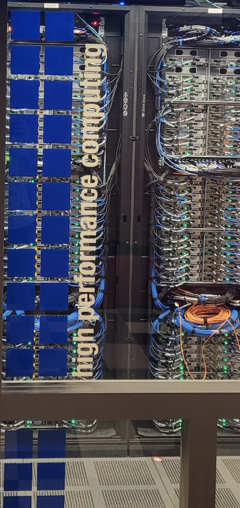
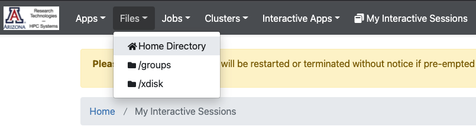
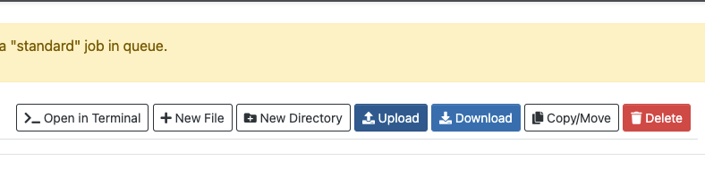
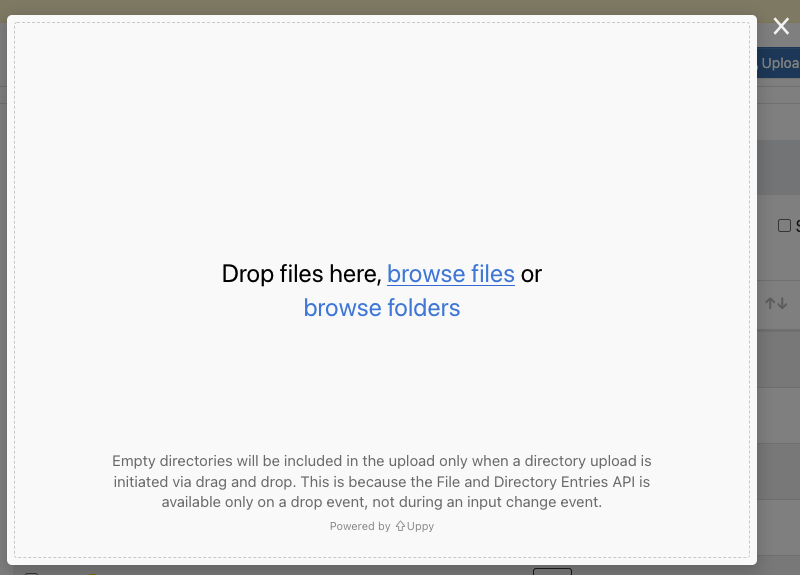

# Intro to HPC Workshop

<br> 

[](intro-to-hpc.tar.gz)[](IntroToHPC.pdf)

<br> 

<h2> Contents </h2>

 

<h3 style="color:#FBFCFC; background-color:#34495E;"> <a href="#overview" style="text-decoration=none; color:#FBFCFC;"> Overview </a> </h3>
<h3 style="color:#FBFCFC; background-color:#34495E;"> <a href="#system-basics" style="text-decoration=none; color:#FBFCFC;"> System Basics </a> </h3>

* [Logging In](#logging-in)
* [Working on the Command Line](#working-on-the-command-line)


<h3 style="color:#FBFCFC; background-color:#34495E;"> <a href="#transferring-files" style="text-decoration=none; color:#FBFCFC;"> Transferring Files </a> </h3>

<h3 style="color:#FBFCFC; background-color:#34495E;"> <a href="#submitting-a-batch-job" style="text-decoration=none; color:#FBFCFC;"> Submitting a Batch Job </a> </h3>

* [Accessing Workshop Files](#accessing-workshop-files)
* [Submission Script Details](#submission-script-overview)
* [Submitting Your Job](#submitting-your-batch-job)
* [Job Output](#job-output)

<h3 style="color:#FBFCFC; background-color:#34495E;"> <a href="#interactive-vs-batch" style="text-decoration=none; color:#FBFCFC;"> Interactive vs. Batch </a> </h3>
<h3 style="color:#FBFCFC; background-color:#34495E;"> <a href="#accessing-software" style="text-decoration=none; color:#FBFCFC;"> Accessing Software </a> </h3>
<h3 style="color:#FBFCFC; background-color:#34495E;"> <a href="#open-ondemand" style="text-decoration=none; color:#FBFCFC;"> Open OnDemand </a> </h3>
<h3 style="color:#FBFCFC; background-color:#34495E;"> <a href="#testing-your-knowledge" style="text-decoration=none; color:#FBFCFC;"> Testing Your Knowledge </a> </h3>
<h3 style="color:#FBFCFC; background-color:#34495E;"> <a href="#getting-help" style="text-decoration=none; color:#FBFCFC;"> Getting Help </a> </h3>
<h3 style="color:#FBFCFC; background-color:#34495E;"> <a href="#community-events" style="text-decoration=none; color:#FBFCFC;"> Community Events </a> </h3>


<br clear="left"/>


<hr style="height:5px; background-color:#34495E; border:none" >


<br>

<h1> <a name="overview" style="text-decoration=none; color:#000000;" > Overview </a> </h1>

This short training class is available to users periodically throughout each academic year. Information on upcoming workshops can be found in our [training documentation](https://public.confluence.arizona.edu/display/UAHPC/Training). Before each workshop, an email will be sent to all HPC users through hpc-announce with information on dates, times, location, and how to register.

This training course will help you get started on using HPC resources.  If you have recently started, you might learn there is a better way, or there are capabilities you are not taking advantage of. You may also want to go through our [quick start](https://public.confluence.arizona.edu/display/UAHPC/Puma+Quick+Start) for additional information.

A PDF of the slides from past workshops can be found in our training documentation linked above and can be downloaded by clicking the Download PDF button at the top of this page. A summary of the training material for the interactive component of this workshop can be found below.

<br>
<hr style="height:5px; background-color:#34495E; border:none" >
<br>

<h1> <a name="system-basics" style="text-decoration=none; color:#000000;"> System Basics </a> </h1>

## Logging In
 

Logging in can be done two ways, either using your own terminal/SSH client or through our Open OnDemand web interface. Both methods are described below.

More detailed information can be found in our [online documentation](https://public.confluence.arizona.edu/display/UAHPC/System+Access#SystemAccess-CommandLine/TerminalAccess).

<br clear="left"/>

### Local terminal
#### Mac/Linux
On a Mac or Linux, open a Terminal (on Mac, this can be found under Applications -> Utilities), and connect to the system using the following as a guide:
```
💻 intro-to-hpc $ ssh your_netid@hpc.arizona.edu
Password: # <- your password goes here
Duo two-factor login for your_netid

Enter a passcode or select one of the following options:

 1. Duo Push to XXX-XXX-XXXX
 2. SMS passcodes to XXX-XXX-XXXX (next code starts with: X)

Passcode or option (1-2): 1
Success. Logging you in...
This is a bastion host used to access the rest of the RT/HPC environment.

Type "shell" to access the job submission hosts for all environments
-----------------------------------------

[your_netid@gatekeeper 16:26:46 ~]$ shell
***
The default cluster for job submission is Puma
***
Shortcut commands change the target cluster
-----------------------------------------
Puma:
$ puma
(puma) $
Ocelote:
$ ocelote
(ocelote) $
ElGato:
$ elgato
(elgato) $
-----------------------------------------

(puma) [your_netid@wentletrap ~]$ ocelote
(ocelote) [your_netid@wentletrap ~]$ 

```
#### Windows
 

On Windows, you will need an SSH client such as PuTTY or MobaXterm. In PuTTY, use ```hpc.arizona.edu``` as your hostname, click Open, then enter your NetID at the ```login as``` promt. Once you have duo-authenticated, type ```shell```, then ```ocelote``` to connect to Ocelote.

<br clear="left"/>


### Open OnDemand
Log into [https://ood.hpc.arizona.edu/](https://ood.hpc.arizona.edu/), then select the **Clusters** dropdown tab and click **Shell Access**


Once you're connected, type ```ocelote``` to connect to Ocelote.

## Working on the Command Line
Once you're logged in, you can interact with the system. Some commands are provided below.

### Linux Shell

|Command|What it does|
|--------|------------------|
|```ls``` | Lists the contents of a directory |
|```pwd```| Prints the location of your working directory |
|```whoami```|Prints your username | 
|```hostname```|Prints the name of the machine you're connected to|
|```which <command>```|Prints the location of the executable ```<command>```|
|```mkdir <directory_name>```| Create a directory with name ```<directory_name>```|
|```cd```|Change directories|
|```cp <source> <destination>```|Copies a file/directory from ```source``` to ```destination```|
|```cat <filename>```|Prints the contents of a text file ```<filename>``` to the terminal|


### HPC-Specific

|Command|What it does|
|--------|------------------|
|```uquota```|Checks your storage usage|
|```va```|Checks your group's monthly time allocation|
|```nodes-busy```|Displays a visual of a cluster's compute nodes and their usage|
|```system-busy```|Displays a text-based summary of a cluster's compute nodes and their usage|
|```cluster-busy```|Displays a visual of each cluster's average usage. Only available on the login nodes|
|```job-history <jobid>    ```|Prints a detailed summary of a running/completed job|
|```seff <jobid>```|Prints a summary of a completed job's memory and CPU efficiency|


<br>
<hr style="height:5px; background-color:#34495E; border:none" >
<br>


<h1> <a name="transferring-files" style="text-decoration=none; color:#000000;"> Transferring Files </a> </h1>
Uploading small files can be done through [Open Ondemand](ood.hpc.arizona.edu) by going to the **Files** dropdown. 
Select the relevant directory location, e.g. your home directory, and click **upload**:

 


 

Drag/drop your files, or click **Browse Files** to upload

  

Once uploaded, your files will appear in the relevant location

 


For larger files, see our [online documentation](https://public.confluence.arizona.edu/display/UAHPC/Transferring+Files) for better transfer strategies.


<br>
<hr style="height:5px; background-color:#34495E; border:none" >
<br>


<h1> <a name="submitting-a-batch-job" style="text-decoration=none; color:#000000;"> Submitting a Batch Job </a> </h1>
## Accessing Workshop Files

To access the files you need for this workshop, use the following commands:

```
mkdir intro-to-hpc
cd intro-to-hpc
cp /xdisk/chrisreidy/workshops/sample_slurm.script .
```
Note, the ```.``` at the end. This is shorthand for your current working directory.

If you get a permission denied message using cp, you likely haven’t been added to the group chrisreidy. If this is the case, stay in your intro-to-hpc directory and use:
```
wget https://ua-researchcomputing-hpc.github.io/Intro-to-HPC/intro-to-hpc.tar.gz
tar xzvf intro-to-hpc.tar.gz --strip-components=1
rm intro-to-hpc.tar.gz
```

## Submission Script Overview
The bash command ```cat``` will print a file's contents to your screen. View the contents of the sample script you just copied using:
```
cat sample_slurm.script
```
This should display the following:
```
#!/bin/bash
#SBATCH --job-name=test
#SBATCH -e test.e%A
#SBATCH -o test.o%A
#SBATCH --partition=windfall
#SBATCH --nodes=1
#SBATCH --ntasks=1
#SBATCH --time=00:10:00
echo 'This script is running on:'
hostname
sleep 120
```
Note that there are three components to the script above:
1. The first line ```#!/bin/bash``` is called a "shebang" and specifies the language interpreter which will be used to execute the script. In this case, it's set to Bash.
2. Lines beginning with ```#SBATCH``` are SLURM directives used to set job specifications. This include requesting compute resources, setting output filenames, requesting email notifications, etc.
3. Everything after the last ```#SBATCH``` are the commands that will be executed on the compute node(s).


## Submitting Your Batch Job
The command ```sbatch``` will submit your script to the job scheduler to run on one of Ocelote's compute nodes:
```
sbatch sample_slurm.script
```
If everything worked correctly, a job ID will be printed to the screen that you can use to track it's progress using:
```
squeue --job <your_job_id>
```

For example:
```
(ocelote) [netid@wentletrap intro-to-hpc]$ sbatch sample_slurm.script 
Submitted batch job 463482
(ocelote) [netid@wentletrap intro-to-hpc]$ squeue --job 463482
             JOBID PARTITION     NAME  USER ST       TIME  NODES NODELIST(REASON)
            463482  windfall     test netid PD       0:00      1 (Priority)
```

## Job Output
Once your job starts running, an output file will be created in the directory where you submitted your script. In this case, you will have two output files that will look like ```test.o<jobid>``` and ```test.e<jobid>```. The first will be any standard output that would have been printed to the terminal had you run your work interactively and the second will contain any errors. First, check if you have output files using ```ls```. If they exist, check their contents using ```cat```. For example:

```
(ocelote) [netid@wentletrap intro-to-hpc]$ ls
test.e463482  test.o463482  sample_slurm.script
(ocelote) [netid@wentletrap intro-to-hpc]$ cat test.o463482 
This script is running on:
i11n1.ocelote.hpc.arizona.edu
```

<br>
<hr style="height:5px; background-color:#34495E; border:none" >
<br>

<h1> <a name="interactive-vs-batch" style="text-decoration=none; color:#000000;"> Interactive vs. Batch </a> </h1>

Sometimes you need to work with your analyses interactively, for example:
1. To compile code
2. To execute test runs
3. To test software/system modules

The built-in command ```interactive``` will put you on a compute node where you'll have access to compute resources and system modules. You'll notice your command prompt will change its hostname once your session starts to reflect the machine you're connected to. For example:
```
(ocelote) [netid@junonia ~]$ interactive
Run "interactive -h for help customizing interactive use"
Submitting with /usr/local/bin/salloc --job-name=interactive --mem-per-cpu=4GB --nodes=1    --ntasks=1 --time=01:00:00 --account=windfall --partition=windfall
salloc: Pending job allocation 464177
salloc: job 464177 queued and waiting for resources
salloc: job 464177 has been allocated resources
salloc: Granted job allocation 464177
salloc: Waiting for resource configuration
salloc: Nodes i15n0 are ready for job
[netid@i15n0 ~]$ 
```

Try running ```interactive --help``` for information on full usage.

<br>
<hr style="height:5px; background-color:#34495E; border:none" >
<br>

<h1> <a name="accessing-software" style="text-decoration=none; color:#000000;"> Accessing Software </a> </h1>
Software packages are installed on HPC's compute nodes as [software modules](https://public.confluence.arizona.edu/display/UAHPC/Software+Resources). Note that software modules are not available on the login nodes. See the section on <a href="interactive-vs-batch"> Interactive Sessions </a> for accessing a compute node. 

<br>
Software modules are accessible using the command ```module```:

| Command | Description | Example| 
|---------|-------------|--------|
|```module avail```| Prints available modules on the system | ```module avail python```|
|```module load```| Adds software to your environment| ```module load python/3.6```|
|```module unload```| Unloads software from your environment| ```module unload python/3.6```|
|```module swap```| Swaps software versions in your environment| ```module swap python/3.6 python/3.8```|

<br>
<hr style="height:5px; background-color:#34495E; border:none" >
<br>

<h1> <a name="open-ondemand" style="text-decoration=none; color:#000000;" > Open OnDemand </a> </h1>

<br>
<hr style="height:5px; background-color:#34495E; border:none" >
<br>

<h1> <a name="testing-your-knowledge" style="text-decoration=none; color:#000000;"> Testing Your Knowledge </a> </h1>

## Batch Scripts
In the exercises below, try modifying and submitting your submission script based on the prompts. For details on SLURM directives, see our [SLURM documentation](https://public.confluence.arizona.edu/display/UAHPC/Running+Jobs+with+SLURM#RunningJobswithSLURM-PBS%E2%86%92SLURMRosettaStone)

* **Change your script to use 4 CPUs instead of 1.**
<details>
  <summary>
    Click here for the solution
    <span class="icon">👇</span>
  </summary>
<pre>
<code>
#!/bin/bash
#SBATCH --job-name=test 
#SBATCH -e test.e%A 
#SBATCH -o test.o%A 
#SBATCH --partition=windfall 
#SBATCH --nodes=1 
#SBATCH --ntasks=4 
#SBATCH --time=00:10:00 
echo 'This script is running on:' 
hostname 
sleep 120 
</code>
</pre>
</details>

<br>

* **Change your script to use the standard partition instead of windfall.**
<details>
  <summary>
    Click here for the solution
    <span class="icon">👇</span>
  </summary>
<pre>
<code>
#!/bin/bash
#SBATCH --job-name=test 
#SBATCH -e test.e%A 
#SBATCH -o test.o%A 
#SBATCH --partition=standard
#SBATCH --account=your_group
#SBATCH --nodes=1 
#SBATCH --ntasks=1
#SBATCH --time=00:10:00 
echo 'This script is running on:' 
hostname 
sleep 120 
</code>
</pre>
     * If you don't know your group's name, run the command <code>va</code> to see which groups you are a member of.
</details>


<br>
<hr style="height:5px; background-color:#34495E; border:none" >
<br>

<h1> <a name="getting-help" style="text-decoration=none; color:#000000;"> Getting Help </a> </h1>

| | Description | Link |
|------|-------|-------|
|Documentation |Detailed HPC information  | [docs.hpc.arizona.edu](docs.hpc.arizona.edu) |
|Consulting Services| Contact us for HPC, statistical, or visualization consulting | [Service Now request forms](https://uarizona.service-now.com/sp?id=sc_category&sys_id=84d3d1acdbc8f4109627d90d6896191f&catalog_id=e0d08b13c3330100c8b837659bba8fb4)|
|Office Hours | Drop by for weekly virtual office hours, every Wednesday from 2:00-4:00 pm| [Click here to join](https://gather.town/app/dVsAprPNBVmI9NpL/hpc-office-hours)|

<br>
<hr style="height:5px; background-color:#34495E; border:none" >
<br>

<h1> <a name="community-events" style="text-decoration=none; color:#000000;"> Community Events </a> </h1>
 

ResBaz provides a supportive community for anyone, of any level of expertise, involved in research computing. Weekly social events include Coffee & Code and Hacky Hour where you can go to meet other research professionals and get help. For more information, see: [https://researchbazaar.arizona.edu/](https://researchbazaar.arizona.edu/)

**Coffee and Code**  
Time: Tuesdays 8:00-10:00am. Location: Catalyst Café (Keating building), 1657 E Helen St.

**Hacky Hour**  
Time: Thursdays 4:00-7:00pm. Location: Snakes & Lattes (Main Gate Square), 865 E University Blvd

<br clear="left"/>

<hr style="height:15px; background-color:#313131; border:none" >

[](https://ua-researchcomputing-hpc.github.io/) 
[](../)
