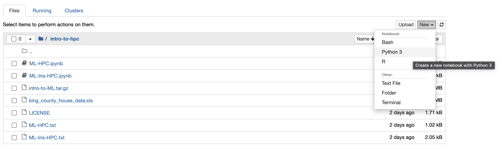
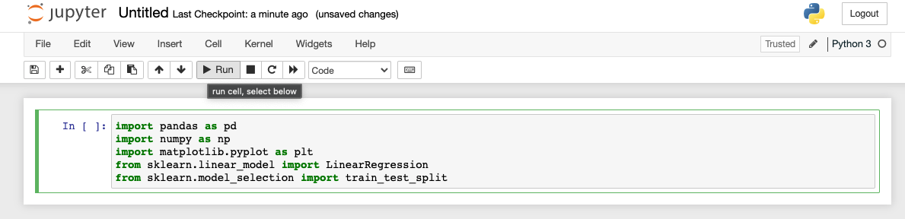
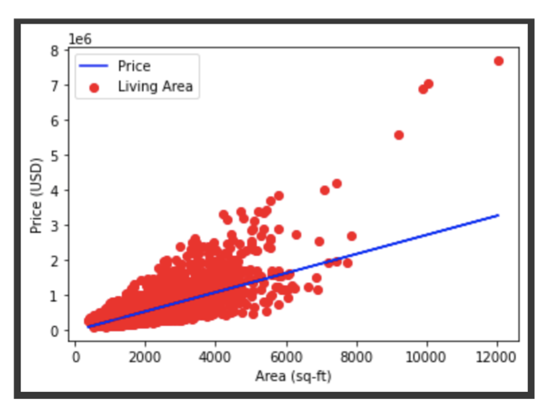

# Intro to Machine Learning

## Contents
1. [Overview](#overview)
2. [Setting up](#setting-up)
    1. [Accessing the Data](#accessing-the-data)
    2. [Starting a Jupyter Session](#starting-a-jupyter-session)
    3. [Opening a Notebook](#opening-a-notebook)
3. [Linear Regression Example](#linear-regression-example)
4. [Clustering Model Example](#clustering-model-example)


## Get the Files
[](intro-to-ML.tar.gz)


--------------

# Overview

This short training class is available to users periodically throughout each academic year. Information on upcoming workshops can be found in our [training documentation](https://public.confluence.arizona.edu/display/UAHPC/Training). Before each workshop, an email will be sent to all HPC users through hpc-announce with information on dates, times, location, and how to register.

This workshop provides a brief introduction to key concepts of machine learning and is followed by two hands-on examples that emphasize running a Jupyter notebook on the HPC supercomputers. 

A PDF of the slides from past workshops can be found in our training documentation linked above. Instructions and training material for the interactive component of this workshop can be found below.


--------------

# Setting up
A component of these workshops is interactive where users will learn to:

1. Train and visualize a linear regression model using a training set.
2. Build and visualize a clustering model using the elbow method.

Both of these exercises will make use of Python in a Jupyter Notebook through Open OnDemand.

## Accessing the Data
To begin, start a terminal to log into the system and copy the necessary files into your account. If you're unsure of how to use or access a terminal, see [our online documentation](https://public.confluence.arizona.edu/display/UAHPC/System+Access#SystemAccess-CommandLine/TerminalAccess) for information (or, if you're in a live workshop, flag one of us down and we can help). To get the files you need, use the following commands: 
```
ssh your_netid@hpc.arizona.edu
shell
ocelote
mkdir intro_to_hpc
cd intro_to_hpc
cp /xdisk/chrisreidy/workshops/* .
```
If you get a permission denied message using ```cp```, you likely haven't been added to the group ```chrisreidy```. If this is the case, stay in your ```intro_to_hpc``` directory and use:
```
wget https://ua-researchcomputing-hpc.github.io/Intro-to-Machine-Learning/intro-to-ML.tar.gz
tar xzvf intro-to-ML.tar.gz --strip-components=1
rm intro-to-ML.tar.gz
```

## Starting a Jupyter Session
For this tutorial, we'll use a Jupyter Notebook which is available as an interactive application and can be accessed through [Open OnDemand](https://ood.hpc.arizona.edu/).

 

Once you log in using your university credentials, click the **Interactive Apps** dropdown menu and select **Jupyter Notebook**. This will bring you to a web form that's used to request compute resources on one of our clusters. Use the following options in your request:

|Option|Value|
|------|-----|
|Cluster|Ocelote Cluter|
|Run Time | 2|
|Core count on a single node | 1 |
|Memory per core|6|
|GPUs required|0|
|PI Group | your group**|
|Queue | standard|

** If you don't know your group's name, go to a terminal session (see section above) and use the command ```va```.


Once you complete the form, click **Launch**. This will bring you to a page with a tile that shows your pending job. When it's first submitted, its status will show as Queued. Once it starts, it's status will change to Running and you'll be given a link you can use to connect. 


## Opening a Notebook
Once you've clicked Launch, you'll see a file navigator. This is your home directory on HPC. To access the files for the examples, click the **intro-to-hpc** directory you created earlier. To open a notebook, click the **New** dropdown menu in the upper right and select **python3**.



## Running Code
To run Python code in a notebook, enter your commands into a cell and click **Run**. To add a new cell, click the **+** in the upper left. 



--------------


# Linear Regression Example



Import Libraries
```
import pandas as pd
import numpy as np
import matplotlib.pyplot as plt
from sklearn.linear_model import LinearRegression
from sklearn.model_selection import train_test_split
```
Use Pandas to load the data and view the first five rows
```
data = pd.read_excel("king_county_house_data.xls")
data.head(5)
```
Choose the columns from the data and split into train and test sets
```
space = data['sqft_living']
price = data['price']
# Change X into 2D array
X = np.array(space).reshape(-1, 1)
Y = np.array(price)
# Split data into train sets and test sets
X_train,X_test,Y_train,Y_test = train_test_split(X,Y,test_size=1/3,random_state=0)
```
Visualize the train set
```
# Visualize training set
plt.scatter(X_train,Y_train,color="red",label="Living Area")
plt.title("Housing Prices")
plt.xlabel("Area")
plt.ylabel("Price")
plt.legend()
plt.show()
```
Train the model with the training set and predict with the test set
```
# Train
regressor = LinearRegression()
regressor.fit(X_train, Y_train)
# Prediction
y_pred = regressor.predict(X_test)
```

Visualize the train data and the best fit line
```
# Visualize the data and the best fit line
plt.scatter(X_train,Y_train,color="red",label="Living Area")
plt.title("Housing Prices in King County")
plt.plot(X_train,regressor.predict(X_train),color="blue",label="Price")
plt.xlabel("Area")
plt.ylabel("Price")
plt.legend()
plt.show()
```
Predict the price of a house with a certain area
```
# Make a prediction
area = 5000
price = regressor.predict([[area]])
print('House of %d sq-ft costs about $%d' % (area, price))
```
Visualize the test data
```
# Visualize test set
plt.scatter(X_test,Y_test,color='red',label="Living Area")
plt.plot(X_test,regressor.predict(X_test),color="blue",label="Price")
plt.xlabel="Area (sq-ft)")
plt.ylabel("Price (USD)")
plt.legend()
plt.show()
```


--------------

# Clustering Model Example


Import libraries 
```
# import libraries
import numpy as np
import pandas as pd
import matplotlib.pyplot as plt
import seaborn as sns
%matplotlib inline
from sklearn.cluster import KMeans
from sklearn.datasets import load_iris
```
Load the data
```
# load the data
iris=load_iris()
iris
```
Convert to a datafram
```
df=pd.DataFrame(data=iris.data, columns=['sepal length','sepal width','petal length','petal width'])
df['target']=pd.Series(iris.target)
df
```
Visualize the data
```
# visualize the data
plt.scatter(x=df['sepal length'], y=df['sepal width'] ,c=iris.target, cmap='gist_rainbow')
plt.xlabel('Sepal Width', fontsize=18)
plt.ylabel('Sepal Length', fontsize=18)
```
Estimate k with elbow method. First try k=5.
```
# Estimate k with elbow at k=5
x = iris.data
kmeans5 = KMeans(n_clusters=5,init = 'k-means++', random_state = 0)
y = kmeans5.fit_predict(x)
print(y)
```
Visualize centers.
```
kmeans5.cluster_centers_
plt.scatter(x[y == 0,0], x[y==0,1], s = 15, c= 'red', label = 'Cluster_1')
plt.scatter(x[y == 1,0], x[y==1,1], s = 15, c= 'blue', label = 'Cluster_2')
plt.scatter(x[y == 2,0], x[y==2,1], s = 15, c= 'green', label = 'Cluster_3')
plt.scatter(x[y == 3,0], x[y==3,1], s = 15, c= 'cyan', label = 'Cluster_4')
plt.scatter(x[y == 4,0], x[y==4,1], s = 15, c= 'magenta', label = 'Cluster_5')
plt.scatter(kmeans5.cluster_centers_[:,0], kmeans5.cluster_centers_[:,1], s = 25, c = 'yellow', label = 'Centroids')
plt.legend()
plt.show()
```
Estimate k with elbow method.
```
# estimate k with elbow method
Error =[]
for i in range(1, 11):
    kmeans11 = KMeans(n_clusters = i, init = 'k-means++', max_iter = 300, n_init = 10, random_state = 0).fit(x)
    kmeans11.fit(x)
    Error.append(kmeans11.inertia_)
import matplotlib.pyplot as plt
plt.plot(range(1, 11), Error)
plt.title('Elbow Method with k=1-11') #within cluster sum of squares
plt.xlabel('Number of clusters')
plt.ylabel('Error')
plt.show()
```
Get the optimal k=3 from the elbow method. Cluster centers and visualize.
```
kmeans3 = KMeans(n_clusters=3, random_state=21)
y = kmeans3.fit_predict(x)
kmeans3.cluster_centers_
plt.scatter(x[y == 0,0], x[y==0,1], s = 15, c= 'red', label = 'Cluster_1')
plt.scatter(x[y == 1,0], x[y==1,1], s = 15, c= 'blue', label = 'Cluster_2')
plt.scatter(x[y == 2,0], x[y==2,1], s = 15, c= 'green', label = 'Cluster_3')
plt.scatter(kmeans3.cluster_centers_[:,0], kmeans3.cluster_centers_[:,1], s = 25, c = 'black', label = 'Centroids')
plt.legend()
plt.show()
```


*****

[](https://ua-researchcomputing-hpc.github.io/) 
[](../)

