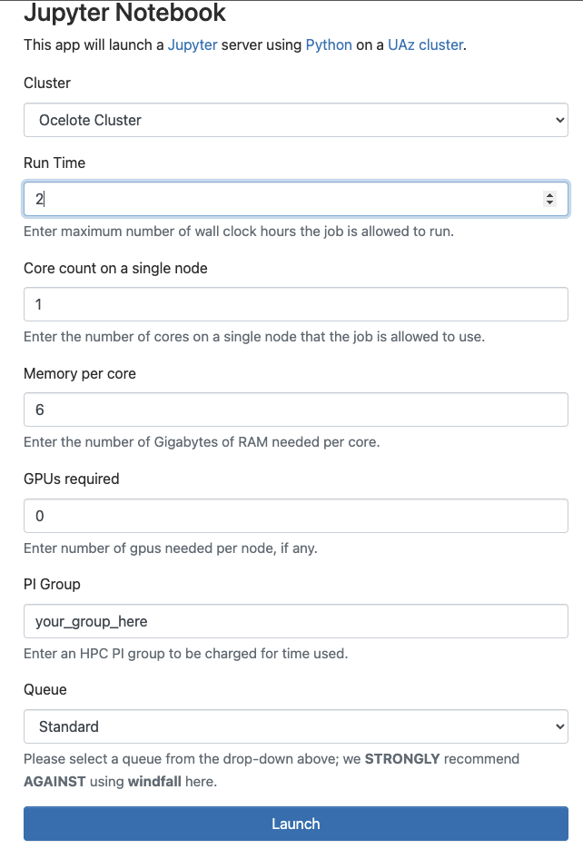
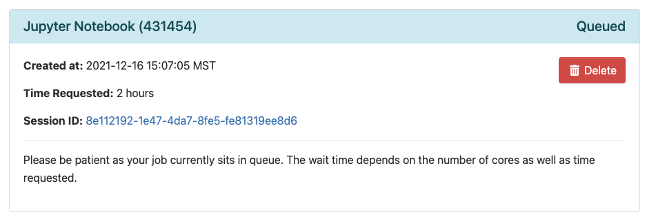

# Intro to Machine Learning

[](intro-to-ML.tar.gz)

1. [Overview](#overview)
2. [Setting up for Interactive Work](#setting-up-for-interactive-work)
    1. [Accessing the Data](#accessing-the-data)
    2. [Starting a Jupyter Notebook](#starting-a-jupyter-notebook)
3. [Linear Regression Example](#linear-regression-example)
4. [Clustering Model Example](#clustering-model-example)


--------------

# Overview

This short training class is available to users periodically throughout each academic year. Information on upcoming workshops can be found in our [training documentation](https://public.confluence.arizona.edu/display/UAHPC/Training). Before each workshop, an email will be sent to all HPC users through hpc-announce with information on dates, timing, location, and registration.

This workshop provides a brief introduction to key concepts of machine learning and is followed by two hands-on examples that emphasize running a Jupyter notebook on the HPC supercomputers. 

A PDF of the slides from past workshops can be found in our training documentation linked above. 


--------------

# Setting up for Interactive Work
A component of these workshops is interactive where users will learn to:

1. Train and visualize a linear regression model using a training set.
2. Build and visualize a clustering model using the "elbow method".

Both of these exercises will make use of python in a Jupyter Notebook through Open OnDemand.

## Accessing the Data
To access the files you need, start a terminal to log into the system and copy the necessary files into your account. If you're unsure of how to use or access a terminal, see [our online documentation](https://public.confluence.arizona.edu/display/UAHPC/System+Access#SystemAccess-CommandLine/TerminalAccess) for information (or, if you're in a live workshop, flag one of us down and we can help). To get the files you need, use the following commands: 
```
ssh your_netid@hpc.arizona.edu
shell
ocelote
mkdir intro_to_hpc
cd intro_to_hpc
cp /xdisk/chrisreidy/workshops/* .
```
If you get a permission denied message using ```cp```, you likely haven't been added to the group ```chrisreidy```. If this is the case, stay in your ```intro_to_hpc``` directory and try:
```
wget https://ua-researchcomputing-hpc.github.io/Intro-to-Machine-Learning/intro-to-ML.tar.gz
tar xzvf intro-to-ML.tar.gz --strip-components=1
rm intro-to-ML.tar.gz
```

## Starting a Jupyter Notebook
We'll use a Jupyter Notebook through Open OnDemand which is available as an interactive application and can be accessed here: https://ood.hpc.arizona.edu/

Once you log in using your university credentials, click the Interactive Apps dropdown menu and select "Jupyter Notebook"


This will bring you to a web form that's used to request compute resources on one of our clusters. Use the following options to request your session:



|Option|Value|
|------|-----|
|Run Time | 2|
|Core count on a single node | 1 |
|Memory per core|6|
|GPUs required|0|
|PI Group | your group**|
|Queue | standard|


** If you don't know your group's name, go to a terminal session (see section above) and use the command ```va```.


Once you complete the form, click Submit. This will bring you to a page with a tile that shows your pending job. When it's first submitted, its status will show as pending. Once it starts, it's status will change to Running and you'll be given a link you can use to connect. 

<figure>
    
    <figcaption>Queued session waiting to start.</figcaption>
</figure>
<figure>
    
    <figcaption>Session that has started with link to connect.</figcaption>
</figure>


--------------


# Linear Regression Example

--------------

# Clustering Model Example

*****
[](https://ua-researchcomputing-hpc.github.io/) 
[](../)

