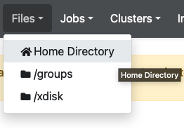
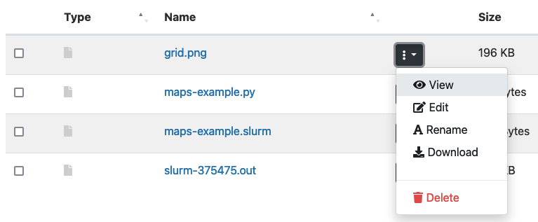
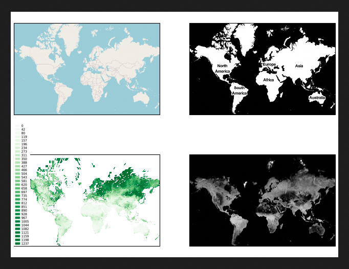

# Using an Anaconda Environment in a Batch Script

This example goes over the general process of creating and activating a local anaconda environment, installing packages, and using them in a batch job. For more information on anaconda on HPC, see our [online documentation](https://public.confluence.arizona.edu/display/UAHPC/Using+and+Installing+Python). 


## Creating your environment and installing packages
In this example, we'll install some map-making software called eomaps into a conda environment. Once the software is installed, we'll generate some fun maps in a batch job.

### Start an interactive session
To get access to system software, you'll need to be on a compute node. These can be accessed by requesting [an interactive session](https://public.confluence.arizona.edu/display/UAHPC/Running+Jobs+with+SLURM#RunningJobswithSLURM-interactive-jobsInteractiveJobs) using the command ```interactive``` from a login node:

```console
💻 Desktop $ ssh netid@hpc.arizona.edu
Last login: Wed Aug 24 14:31:24 2022
This is a bastion host used to access the rest of the RT/HPC environment.

Type "shell" to access the job submission hosts for all environments
-----------------------------------------
[netid@gatekeeper 14:36:51 ~]$ shell
Last login: Wed Aug 24 14:26:30 2022 from gatekeeper.hpc.arizona.edu
***
The default cluster for job submission is Puma
***
Shortcut commands change the target cluster
-----------------------------------------
Puma:
$ puma
(puma) $
Ocelote:
$ ocelote
(ocelote) $
ElGato:
$ elgato
(elgato) $
-----------------------------------------

(puma) [netid@wentletrap ~]$ elgato
(elgato) [netid@wentletrap ~]$ interactive -a hpcteam
Run "interactive -h for help customizing interactive use"
Submitting with /usr/local/bin/salloc --job-name=interactive --mem-per-cpu=4GB --nodes=1    --ntasks=1 --time=01:00:00 --account=hpcteam --partition=standard
salloc: Pending job allocation 375456
salloc: job 375456 queued and waiting for resources
salloc: job 375456 has been allocated resources
salloc: Granted job allocation 375456
salloc: Waiting for resource configuration
salloc: Nodes cpu4 are ready for job
[netid@cpu4 ~]$ 

```

### Initialize Anaconda (if necessary)
> If you've already initialized Anaconda in your account, you can ignore this step

Once your session starts, load the anaconda module including version:

```console
[netid@cpu4 ~]$ module avail anaconda | grep anaconda
   anaconda/2020.02    anaconda/2020.11    anaconda/2022.05 (D)
[netid@cpu4 ~]$ module load anaconda/2022.05
```
If you have never used Anaconda in your account before, you'll need to initialize it using ```conda init bash```:

```console
[netid@cpu4 ~]$ conda init bash
no change     /opt/ohpc/pub/apps/anaconda/2022.05/condabin/conda
no change     /opt/ohpc/pub/apps/anaconda/2022.05/bin/conda
no change     /opt/ohpc/pub/apps/anaconda/2022.05/bin/conda-env
no change     /opt/ohpc/pub/apps/anaconda/2022.05/bin/activate
no change     /opt/ohpc/pub/apps/anaconda/2022.05/bin/deactivate
no change     /opt/ohpc/pub/apps/anaconda/2022.05/etc/profile.d/conda.sh
no change     /opt/ohpc/pub/apps/anaconda/2022.05/etc/fish/conf.d/conda.fish
no change     /opt/ohpc/pub/apps/anaconda/2022.05/shell/condabin/Conda.psm1
no change     /opt/ohpc/pub/apps/anaconda/2022.05/shell/condabin/conda-hook.ps1
no change     /opt/ohpc/pub/apps/anaconda/2022.05/lib/python3.9/site-packages/xontrib/conda.xsh
no change     /opt/ohpc/pub/apps/anaconda/2022.05/etc/profile.d/conda.csh
modified      /home/u00/netid/.bashrc

==> For changes to take effect, close and re-open your current shell. <==

[netid@cpu4 ~]$ source ~/.bashrc  # <-- Make changes live. Run this instead of closing/reopening your shell
(base) [netid@cpu4 ~]$ 
```

### Turn off auto-activiation feature
By default, Anaconda activates itself in your environment whenever you log in. This isn't ideal and can result in a number of errors when using the system. To permanently prevent Anaconda from automatically activating:

```console
[netid@cpu4 ~]$ conda config --set auto_activate_base false
```

### Create your environment and install software

```console
(base) [netid@cpu4 ~]$ conda create --name maps python=3.8
(base) [netid@cpu4 ~]$ conda activate maps
(maps) [netid@cpu4 ~]$ conda install -c conda-forge eomaps
```

----------

## Creating a batch job
The following steps can be taken either on a login node or on a compute node.

### Python script
We'll create a script based on an example from [eomaps' online documentation](https://eomaps.readthedocs.io/en/latest/api.html#webmap-layers). We'll make a directory in our home called maps-example and write the code to a file called maps-example.py:

```
(elgato) [netid@wentletrap ~]$ cd maps-example
(elgato) [netid@wentletrap maps-example]$ ls
maps-example.py
```
Where the contents of maps-example.py are:
```python3
#!/usr/bin/env python3

from eomaps import Maps, MapsGrid
mg = MapsGrid(crs=Maps.CRS.GOOGLE_MERCATOR)
mg.join_limits()

mg.m_0_0.add_wms.OpenStreetMap.add_layer.default()
mg.m_0_1.add_wms.OpenStreetMap.add_layer.stamen_toner()

mg.m_1_1.add_wms.S1GBM.add_layer.vv()

# ... for more advanced
layer = mg.m_1_0.add_wms.ISRIC_SoilGrids.nitrogen.add_layer.nitrogen_0_5cm_mean
layer.set_extent_to_bbox() # set the extent according to the boundingBox
layer.info                 # the "info" property provides useful information on the layer
layer()                    # call the layer to add it to the map
layer.add_legend()         # if a legend is provided, you can add it to the map!
mg.safefig("grid.png",psi=500)
```

### SLURM script
Because conda's auto-activate feature is turned off, we'll need to use the command ```source ~/.bashrc``` to add ```conda``` to our environment:

```bash
#!/bin/bash
#SBATCH --account=YOUR_GROUP
#SBATCH --partition=standard
#SBATCH --nodes=1
#SBATCH --ntasks=1
#SBATCH --time=00:05:00

source ~/.bashrc  # <- Required to give you access to conda command if auto-activate has been turned off
conda activate maps
python3 maps-example.py
```

## Submit the job
```console
(elgato) [netid@wentletrap maps-example]$ ls
maps-example.py  maps-example.slurm
(elgato) [netid@wentletrap maps-example]$ sbatch maps-example.slurm 
Submitted batch job 375475
```

## Retrieve the results

A slurm-$JOBID.out file will be generated with all the text that would have been printed to the terminal had you run it interactively Additionally, you will receive a png file with the generated figure:
```console
(elgato) [netid@wentletrap maps-example]$ ls
slurm-375475.out  grid.png  maps-example.py  maps-example.slurm
(elgato) [netid@wentletrap maps-example]$ cat slurm-375475.out 
EOmaps: ... adding wms-layer OSM_default
EOmaps: ... adding wms-layer OSM_stamen_toner
EOmaps: ... adding wms-layer S1GBM_vv
EOmaps: fetching IRIS layers...
EOmaps: could not determine bbox from 'boundingBox'... defaulting to 'boundingBoxWGS84'

 LEGEND available: True

auth : <Authentication shared=False username=None password=None cert=None verify=True auth_delegate=None>
parent : <owslib.map.wms111.ContentMetadata object at 0x2ac50242e730>
index : '1.4'
id : 'nitrogen_0-5cm_mean'
name : 'nitrogen_0-5cm_mean'
queryable : 1
title : 'Nitrogen 0-5cm mean (cg/kg)'
boundingBox : (-19949800.0,
               -6147500.0,
               19861800.0,
               8361000.0,
               'EPSG:152160')
boundingBoxWGS84 : (-179.998, -55.9773, 179.994, 82.7193)
crsOptions : ['EPSG:54012',
              'EPSG:54009',
              'EPSG:152160',
              'EPSG:3857',
              'EPSG:4326']
styles : {'default': {...}}
keywords : [None]
metadataUrls : [{...}]

EOmaps: ... adding wms-layer nitrogen_0-5cm_mean
Detailed performance metrics for this job will be available at https://metrics.hpc.arizona.edu/#job_viewer?action=show&realm=SUPREMM&resource_id=4&local_job_id=375475 by 8am on 2022/08/25.
```
To view the map, log into [Open OnDemand](https://ood.hpc.arizona.edu), then: 

1. go to the Files dropdown tab



navigate to your maps-example directory, and click on grid.png






**********

[](https://ua-researchcomputing-hpc.github.io/) 
[](../)
