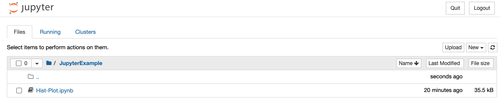
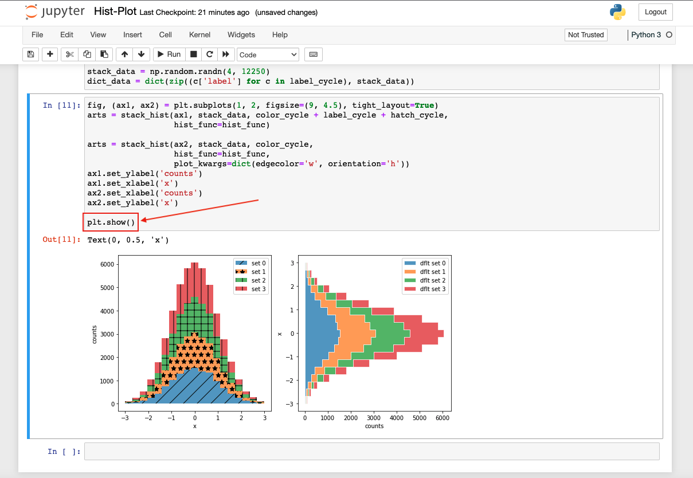
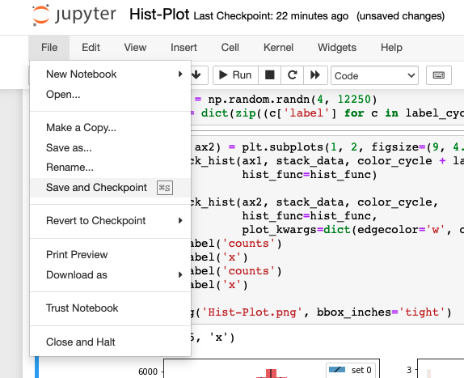
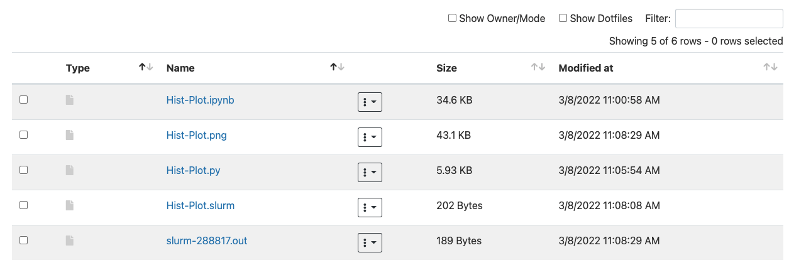
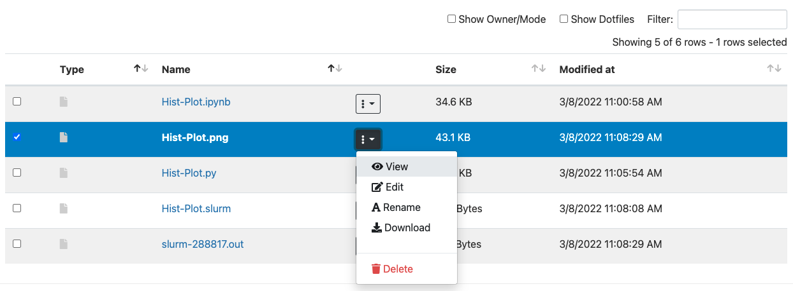
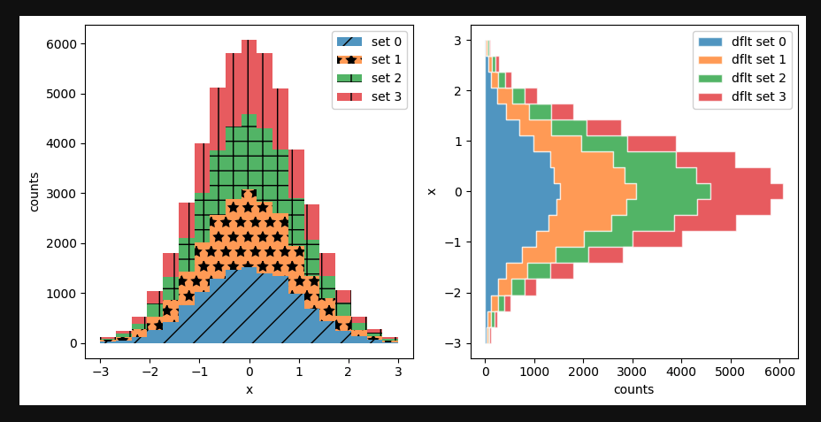

# Converting a Jupyter Notebook to Run in Batch

[](JupyterExample.tar.gz)

# Overview
Jupyter notebooks are available to HPC users through our [Open OnDemand web interface](https://ood.hpc.arizona.edu/). This is a great, user-friendly tool and works well for many types of analyses. However, there may be some cases when 

# Example Notebook
The code used to generate the histogram in this example was borrowed from [matplotlib's documentation here](https://matplotlib.org/stable/gallery/lines_bars_and_markers/filled_step.html#sphx-glr-gallery-lines-bars-and-markers-filled-step-py).

Say we have some analysis that generates an image as part of its execution, but takes several hours (or days) to run.  





Change ```plt.show()``` to ```plt.savefig('Hist-Plot.png', bbox_inches='tight')``` and save



# Install Jupyter Notebook Extensions
Log into HPC in a terminal session 

https://public.confluence.arizona.edu/display/UAHPC/System+Access#SystemAccess-CommandLine/TerminalAccess
https://public.confluence.arizona.edu/display/UAHPC/System+Access#SystemAccess-TerminalAccess
https://public.confluence.arizona.edu/display/UAHPC/Running+Jobs+with+SLURM#RunningJobswithSLURM-interactive-jobsInteractiveJobs

```
(elgato) [netid@wentletrap JupyterExample]$ interactive
[netid@cpu27 JupyterExample]$ module load python/3.6
[netid@cpu27 JupyterExample]$ pip install jupyter_contrib_nbextensions
[netid@cpu27 JupyterExample]$ pip install jupyter_nbextensions_configurator
[netid@cpu27 JupyterExample]$ jupyter contrib nbextension install --user
[netid@cpu27 JupyterExample]$ jupyter nbextensions_configurator enable --user
```

# Convert Notebook to Python Script
```
[netid@cpu27 JupyterExample]$ ls
Hist-Plot.ipynb
[netid@cpu27 JupyterExample]$ jupyter nbconvert --to script Hist-Plot.ipynb
[NbConvertApp] Converting notebook Hist-Plot.ipynb to script
[NbConvertApp] Writing 6075 bytes to Hist-Plot.py
[netid@cpu27 JupyterExample]$ ls
Hist-Plot.ipynb  Hist-Plot.py
```

# Create a Batch Script
```
#!/bin/bash
#SBATCH --job-name=Hist-Plot
#SBATCH --time=00:01:00
#SBATCH --nodes=1
#SBATCH --ntasks=1
#SBATCH --account=hpcteam
#SBATCH --partition=standard

module load python/3.6
python3 Hist-Plot.py
```

# Submit Job
```
[netid@cpu27 JupyterExample]$ sbatch Hist-Plot.slurm 
Submitted batch job 288817
```

# Check Output
```
[netid@cpu27 JupyterExample]$ ls
Hist-Plot.ipynb  slurm-288817.out  Hist-Plot.png  Hist-Plot.py  Hist-Plot.slurm
```





