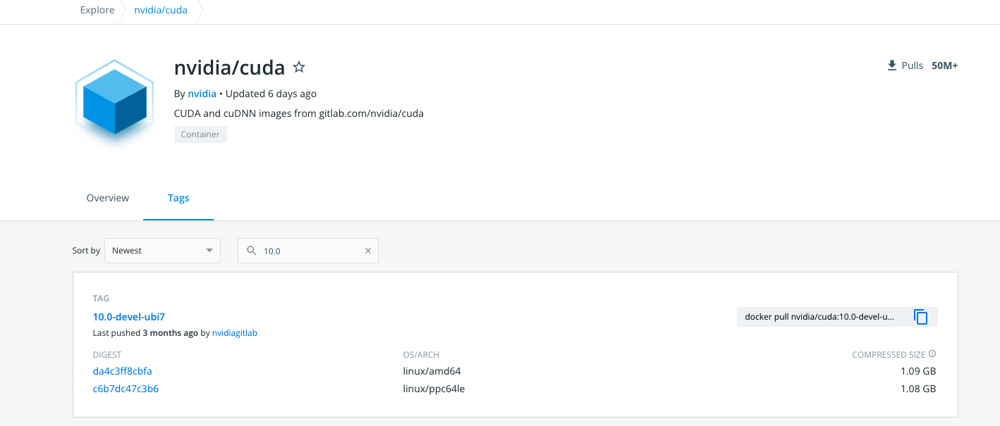
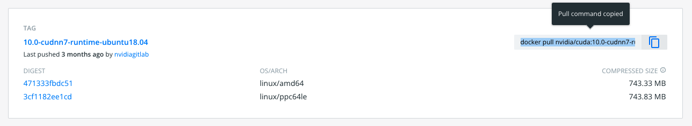

# Creating a Tensorflow Container

One option for running Tensorflow on HPC is to pull pre-built images from [Nvidia's NGC repository](https://public.confluence.arizona.edu/display/UAHPC/Containers#Containers-PullingNvidiaImages). However, this may not always be the optimal solution if you want more flexibility in designing your environment. For example, maybe you need software or Python packages that do not come prepackaged in the NGC images. If this is the case, you can build your own.

The general steps to doing this are:
  1. Identify which version of Tensorflow you need.
  2. Identify a compatible version of Cuda.
  3. Find a Cuda container on Docker Hub to bootstrap from.
  4. Design your recipe.
  5. Build!

In this example, we will build an image using Tensorflow 2.0.0, Cuda 10.0, and Python 3.6.

# Tensorflow and Cuda
One of the difficulties with installing Tensorflow natively on HPC is library versioning. To successfully use a GPU requires that the proper version of Cuda be installed and this is not always possible. For example, older versions of Tensorflow require Cuda 10 and earlier which our drivers do not support.

To find the Cuda you need for your image, see [Tensorflow's documentation on version compatabilities](https://www.tensorflow.org/install/source#tested_build_configurations). In this case, because we want to install Tensorflow 2.0.0, we will need to use Cuda 10.0.  

To build an image using Cuda 10.0, we will go to [Nvidia's Docker Hub repository](https://hub.docker.com/r/nvidia/cuda), go to the Tags tab, and search 10.0:



Tensorflow requires cuDNN libraries so we'll need to find a tag that includes these. We'll also look for an Ubuntu OS (multiple versions are typically available). In this case, we'll choose Ubuntu 18.04. Once you find the tag you want, click the blue rectagles on the right to copy the ```docker pull``` command to your clipboard:



The specific command for this tag is ```docker pull nvidia/cuda:10.0-cudnn7-runtime-ubuntu18.04```

# Creating Your Recipe

> For more detailed information on writing your own Singularity recipes, see [Singularity's definition files](https://sylabs.io/guides/3.0/user-guide/definition_files.html) documentation. 

To create your definition file, navigate to your preferred directory on HPC and open a plain text document. Name it something descriptive, e.g. ```tensorflow-2.0.0-py36.recipe```. This is where we'll write out the blueprints that will be used to create our image.

## Header
First, we'll enter a header that will be used to pull Docker layers from Dockerhub. This is where you will paste in the command you copied to your clipboard. You will need to remove the ```docker pull``` at the start of the command. The header should look like:

```
Bootstrap: docker
FROM:  nvidia/cuda:10.0-cudnn7-devel-ubuntu18.04 
```

## Post
The ```%post``` section contains all the commands that will be executed during the build once the base OS has been installed. This will include installing system software and libraries, downloading files, setting environment variables, pip-installing your python packages, etc. We'll start by sourcing ```/environment``` (this sets relevant default environment variables) and set any necessary paths to point the system to our Cuda libraries:

```
  %post
  . /environment
  SHELL=/bin/bash
  CPATH="/usr/local/cuda/include:$CPATH"
  PATH="/usr/local/cuda/bin:$PATH"
  LD_LIBRARY_PATH="/usr/local/cuda/lib64:$LD_LIBRARY_PATH"
  CUDA_HOME="/usr/local/cuda"
```

Next, we'll need to install system libraries and software using [```apt-get```](https://en.wikipedia.org/wiki/APT_(software)). This will give us access to things like ```wget``` and Python 3.6:
```
  apt-get update
  apt-get install -y wget git vim build-essential cmake libgtk2.0-0 python3.6 python3.6-dev python3.6-venv python3-distutils python3-apt libgtk-3-dev xauth curl
```
To install packages like Tensorflow, we'll need to install ```pip```:
```
  wget https://bootstrap.pypa.io/pip/3.6/get-pip.py
  python3.6 get-pip.py
```
Additionally, we'll make our lives a little easier by creating a command ```python3``` so we don't have to use ```python3.6``` whenever we want to use Python:
```
ln -s /usr/bin/python3.6 /usr/local/bin/python3
```
Now come the pip installs. This is where you would add any Python packages you need. You can use pypi to find the install commands for [previous releases of tensorflow-gpu](https://pypi.org/project/tensorflow-gpu/#history) (as well as other packages). In this case, we'll install tensorflow-gpu 2.0.0 and an additional non-standard package:
```
  pip install tensorflow-gpu==2.0.0
  pip install astropy 
```


## Environment
The last section we'll create is called ```%environment``` and contains all the environment variables that will be set at the containers runtime. There will be some overlap/redundancy with the ```%post``` section. This is because the variables set during the build stage do not carry over to runtime and the variables set in ```%environment``` will not be invoked during the build.
```
  %environment
  # use bash as default shell
  SHELL=/bin/bash
  # add CUDA paths
  CPATH="/usr/local/cuda/include:$CPATH"
  PATH="/usr/local/cuda/bin:$PATH"
  LD_LIBRARY_PATH="/usr/local/cuda/lib64:$LD_LIBRARY_PATH"
  CUDA_HOME="/usr/local/cuda"
  export PATH LD_LIBRARY_PATH CPATH CUDA_HOME
```

# Full Recipe
```
Bootstrap: docker
FROM:  nvidia/cuda:10.0-cudnn7-devel-ubuntu18.04 


%post
  . /environment
  SHELL=/bin/bash
  CPATH="/usr/local/cuda/include:$CPATH"
  PATH="/usr/local/cuda/bin:$PATH"
  LD_LIBRARY_PATH="/usr/local/cuda/lib64:$LD_LIBRARY_PATH"
  CUDA_HOME="/usr/local/cuda"
  apt-get update
  apt-get install -y wget git vim build-essential cmake libgtk2.0-0 python3.6 python3.6-dev python3.6-venv python3-distutils python3-apt libgtk-3-dev xauth curl
  wget https://bootstrap.pypa.io/pip/3.6/get-pip.py
  python3.6 get-pip.py
  ln -s /usr/bin/python3.6 /usr/local/bin/python3
  pip install tensorflow-gpu==2.0.0
  pip install astropy 

%environment
  # use bash as default shell
  SHELL=/bin/bash
  # add CUDA paths
  CPATH="/usr/local/cuda/include:$CPATH"
  PATH="/usr/local/cuda/bin:$PATH"
  LD_LIBRARY_PATH="/usr/local/cuda/lib64:$LD_LIBRARY_PATH"
  CUDA_HOME="/usr/local/cuda"
  export PATH LD_LIBRARY_PATH CPATH CUDA_HOME
```

# Building the Image
> Detailed instructions on building images remotely can be found on the [Singularity Remote Builds](https://ua-researchcomputing-hpc.github.io/Singularity-Examples/Remote-Build/) page.
Save your file and exit your text editor. Then, in an [interactive session](https://public.confluence.arizona.edu/display/UAHPC/Running+Jobs+with+SLURM#RunningJobswithSLURM-interactive-jobsInteractiveJobs), build your image using ```singularity build --remote```. If you have never built a remote image before, you will need to generate an access token. Instructions can be found in the Remote Build page linked at the start of the section above.
```
[netid@cpu37 ~]$ singularity build --remote tensorflow-2.0.0-py36.sif tensorflow-2.0.0-py36.recipe 
```
